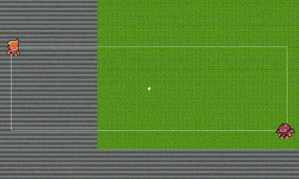
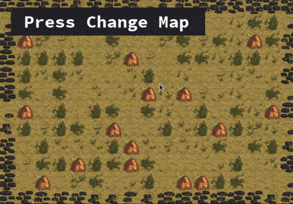
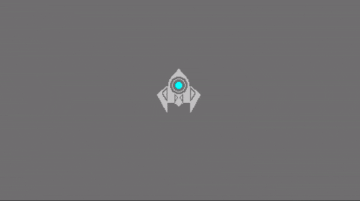
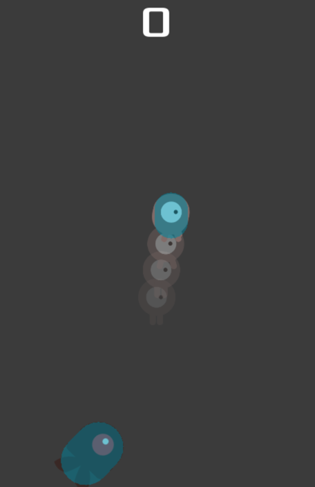

# Godot Lesson

# Camera Far Away
聚焦在多个对象上，镜头伸缩

# Random Ground Map
### 随机地图贴图

# Ship Control
### 学习通过vs和gd两种不同方式控制小船

# dodge_the_creeps
### 躲避游戏，增加两种不同方式的幻影
1. 使用粒子效果，简单，但不能得到玩家当前动作效果，建议做成简单的同色色块跟随
2. 使用 Sprite 和 Tween 获取Player的动画当前贴图，设置起来相当麻烦，但可以获得精准的当前动作图，性能不如粒子效果，但对单个玩家不影响，可扩展性强

